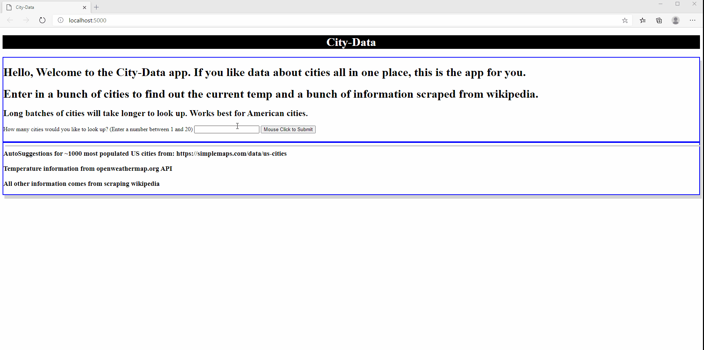
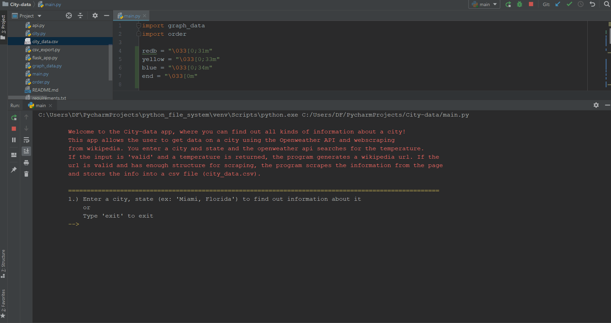

# City-data

This app allows the user to get data on cities using the Openweather API and webscraping from wikipedia. You enter a city and state and the openweather api searches for the temperature. If the input is valid and a temperature is returned, the program generates a wikipedia url. If the url is valid and has enough structure for scraping with BeautifulSoup, the program scrapes the information from the page and stores the info into a csv file (city_data.csv). 

A command line app (main.py) and a GUI flask app (flask_app.py) are available and both are able to show graphs of estimated population and population density **(not all cities have this info)**, export info to csv, and export info to a db for persisting data. The program works best for American cities. 

#
Example of flask_app.py (click image for better quality gif)
 

#
Example of main.py (click image for better quality gif)
 

#
# Instructions:

1. **Clone the repo**
2. **Create an api.py file in the main directory and copy and paste the openWeatherApi variable (ex: ' openWeatherApi = "abc123" ') that is given to you into the file and save.**
3. **pip install -r requirements.txt**
4. Run **main.py** for a command line program

   or

    run **flask_app.py** for GUI and to run batches with some autosuggestions. (Browser should automatically open to http://localhost:5000/)

    * Program written in Python 3.8.6

#

# Features:

* Flask App:
    flask_app.py allows for entry and lookup of up to 20 cities in a webform at a time. Autosuggestions are provided for cities with high population levels in the US. Obvious duplicates are excluded from results. Graphs (via **bokeh**) are provided for population density and estimated population if that information is available. A city_data.csv link is provided for download with the information just obtained about the different cities in that session. Each city and resulting information is also placed in cityDatabase.db. This **SQLite db** can be edited in the CLI mode. 

* CLI:
    main.py allows for individual entry of cities. Each city that returns valid information will be added to city_data.csv (obvious duplicates are excluded) and cityDatabase.db . The city_data.csv is created for each new session. The cityDatbase.db persists across sessions and also includes cities obtained from the flask app. In order to view the db, delete records, edit records, and export to a csv, at least one valid city most be entered via the CLI. One reason to edit a record could be to add "Demonym" information for a city in which wikipedia doesn't have this info. Graphs (via **matplotlib**) are possible for population density and estimated population.  

#

# Future directions: 
* ability to take zip codes
* convert state abbreviations to full state names

#

# Declarations/Thanks:
* Temperature provided by https://openweathermap.org/api 
* City/state suggestion list taken from:  https://simplemaps.com/data/us-cities.
* City data scraped from https://www.wikipedia.org/

#

# Glitches
* In the Flask app, some browsers (i.e. MS Edge) may not always present the updated csv file for download from the link provided despite use of send_file(cache_timeout). However, the updated .csv file will be available in /city_data.csv