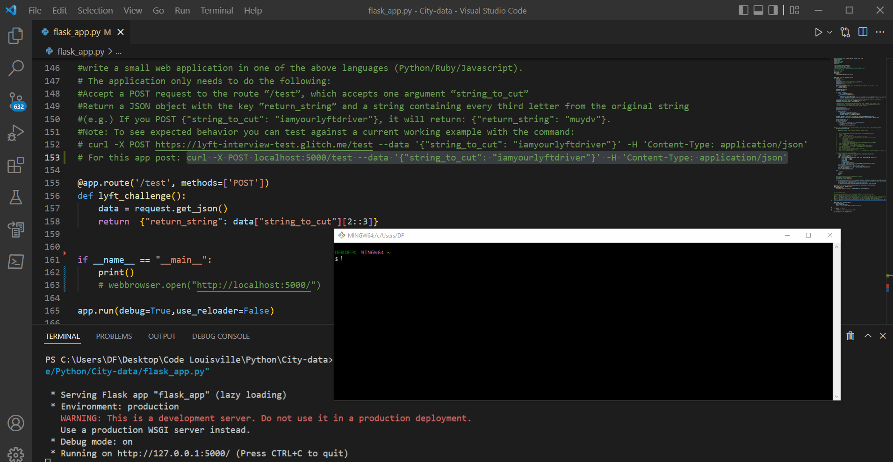
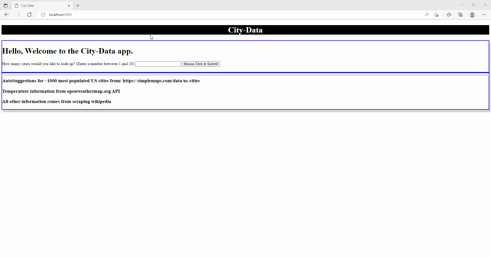
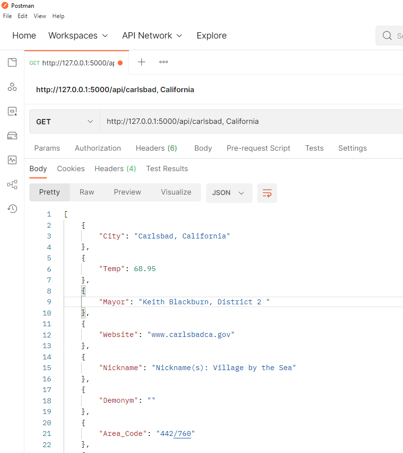

# City-data

* This app allows the user to get data on cities using the openweathermap.org API and webscraping from wikipedia. You enter a city and state and then the openweathermap.org api searches for the temperature. If the input is valid and a temperature is returned, the program generates a wikipedia url. If the url is valid and has enough structure for scraping with BeautifulSoup, the program scrapes the information from the page and shows you some data. 

* A GUI flask app (flask_app.py) and command line app (main.py) are available and both  have the ability to show a graph of population density. **Not all cities have the same information and wikipedia recently changed some of the structure of its city webpages - this results in some blank information.**. The data is exported into a csv (for each session) and also a SQLite database for data persistence across sessions. You can read, update, and delete the entries from within the CLI. The program works best for American cities. 

    While running flask_app.py, an api is also running which accepts a single city/state. So, for example in Postman you could run 

    http://127.0.0.1:5000/api/city, state

    which would return the city data for that particular city. 

    The flask app and CLI basically utilize the same order of operations (order.py) for their similar features.

* The Lyft challenge was also added to the flask_app.py simply because this project included a web app. The Lyft challenge code does not need the openweathermap.org api to run.

#
# Instructions:

1. **Clone the repo**
2. **Create an api.py file in the main directory and copy and paste the openweathermap.org variable (ex: ' OPEN_WEATHER_API = "abc123" ') that is given to you into the file and save.**
3. **pip install -r requirements.txt**
4. Run **main.py** for a command line program

   or

    run **flask_app.py** for GUI and to run batches with some autosuggestions. (Browser should automatically open to http://localhost:5000/)

    For the Lyft challenge, enter the following in the command line after running flask_app.py:
        curl -X POST localhost:5000/test --data '{"string_to_cut": "iamyourlyftdriver"}' -H 'Content-Type: application/json'

#
**Lyft Challenge using Git Bash  (click image for better quality gif)**
<!--   -->

#

# Features:

* Flask App:
    flask_app.py allows for entry and lookup of up to 20 cities in a webform at a time. Autosuggestions are provided for cities with high population levels in the US via javascript. Obvious duplicates are excluded from results. A graph (via **bokeh**) is provided for population density if that information is available. A city_data.csv link is provided for download with the information just obtained about the different cities in that session. Each city and resulting information is also placed in CITY.db. This **SQLite db** can be edited in the CLI mode. 

**Example of flask_app.py (click image for better quality gif)**
<!--   -->

**Example of Postman response to GET request **
<!--   -->

<!-- ![Postman image] -->

* CLI:
    main.py allows for individual entry of cities. Each city that returns valid information will be added to city_data.csv (obvious duplicates are excluded) and CITY.db . The city_data.csv is created for each new session. The cityDatbase.db persists across sessions and also includes cities obtained from the flask app. In order to view the db, delete records, edit records, and export to a csv, at least one valid city most be entered via the CLI. One reason to edit a record could be to add "Demonym" information for a city in which wikipedia doesn't have this info. A graph (via **matplotlib**) is possible for population density.  

**Example of main.py (click image for better quality gif)**
<!--   -->

#

# Possible Future directions: 
* ability to take zip codes
* convert state abbreviations to full state names
* Update wikipedia search criteria for city tables

#

# Declarations/Thanks:
* Temperature provided by https://openweathermap.org/api 
* City/state suggestion list taken from:  https://simplemaps.com/data/us-cities.
* City data scraped from https://www.wikipedia.org/

#

Other:
1. Unit tests can be run with: python -m unittest test_flask_app.py