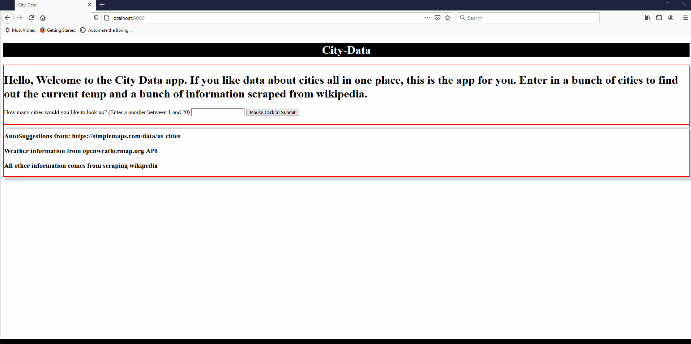

# City-data

This app allows the user to get data on a city (or cities) using the Openweather API and webscraping from wikipedia. You enter a city and state and the openweather api searches for the temperature. If the input is valid and a temperature is returned, the program generates a wikipedia url. If the url is valid and has enough structure for scraping, the program scrapes the information from the page and stores the info into a csv file (city_data.csv). 

A command line app (main.py) and a GUI flask app (flask_app.py) are available (graphs not available on flask.app.py)

For the command line app, Matplotlib can read the csv and show bar graphs of estimated population and population density (not all cities provide this information).  The program works best for American cities. Each wikipedia page has varying information on each city.

#
Example of flask_app.py
 

#
# Instructions:

1. **Clone the repo**
2. **Create an api.py file in the main directory and copy and paste the openWeatherApi variable (ex: ' openWeatherApi = "abc123" ') that is given to you into the file and save.**
3. **PIP install the following or use requirements.txt ( pip install -r requirements.txt):**
    * requests == 2.24.0
    * bs4 == 0.0.1
    * lxml == 4.5.2
    * matplotlib == 3.3.2
    * pandas == 1.1.0
    * Flask == 1.1.2
4. Run **main.py** for a command line program (ability to see graphs of estimated population and population density when available).

   or

    run **flask_app.py** for GUI and to run batches with some autosuggestions. This option still produces a csv in the root directory, however, graphs are not available. (Browser should automatically open to http://localhost:5000/)

    * Program written in Python 3.8.6

#

# Code Louisville Features Met:

* Implement a “master loop” console application where the user can repeatedly enter commands/perform actions, including choosing to exit the program 
    * main.py has a master loop 
* Create a class, then create at least one object of that class and populate it with data
    * city.py utilizes a class
* Create a dictionary or list, populate it with several values, retrieve at least one value, and use it in your program
    * main.py uses cityList variable to store list of cities, search_array.py uses termLineHeader array to temporarily store scraped data
* Read data from an external file, such as text, JSON, CSV, etc and use that data in your application
    * graph_data.py reads city_data.csv to display bar graphs
* Create and call at least 3 functions, at least one of which must return a value that is used
    * multiple functions, termLineHeader() in search_array.py returns an array
* Connect to an external/3rd party API and read data into your app
    * validateByWeatherAPI() in city.py connects to openweathermap.org API
* Visualize data in a graph, chart, or other visual representation of data
    * graph_data.py uses matplotlib and pandas to graph data from a csv
* Implement a “scraper” that can be fed a type of file or URL and pull information off of it.
    * Bs4 is used to scrape wikipedia information in the city.py
* Other features 
    * Flask app

#

* **Future directions:** 
    * ability to take zip codes
    * convert state abbreviations to full state names
    * Only return unique cities
    * Ability to print matplotlib to flask web app. Not able to do this consistently seemingly due to known threading issue (matplotlib likes to be run in the main loop)

# Declarations/Thanks:
* Temperature provided by https://openweathermap.org/api 
* City/state suggestion list taken from:  https://simplemaps.com/data/us-cities.
* City data scraped from https://www.wikipedia.org/

# Glitches
* In the Flask app, some browsers (i.e. MS Edge) may not always present the updated csv file for download from the link provided despite use of send_file( ,cache_timeout). However, the updated .csv file will be available in /city_data.csv